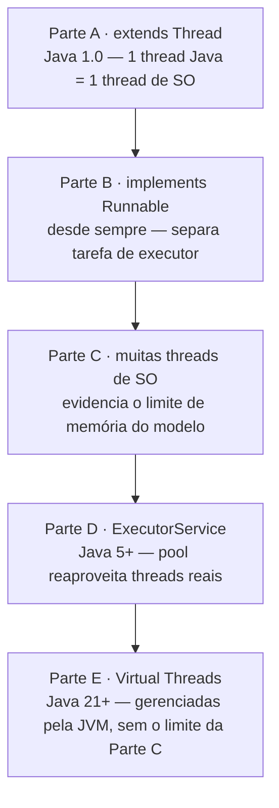
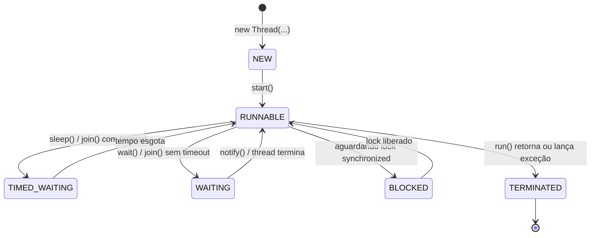

# EX01-LAB — Threads em Java

Roteiro de Laboratório da disciplina de Engenharia de Software (PUC Minas) —
LabDAMD, Unidade 0: Revisão de Sistemas Operacionais e Concorrência.

O exercício usa um cenário propositalmente simples — um **guichê de
atendimento** que atende clientes — para focar no mecanismo de concorrência
(como criar e gerenciar threads), e não na lógica de negócio.

O roteiro completo com as respostas às perguntas está em
[RELATORIO.md](RELATORIO.md). Este README explica o **código**: o que cada
parte faz e por quê foi escrita daquele jeito.

> **Além do roteiro**: este projeto implementa as 5 partes pedidas (A–E) e
> os 2 exercícios de fixação, e ainda acrescenta dois extras (fora do
> escopo mínimo) para aprofundar o entendimento — veja
> [Extras: indo além do roteiro](#extras-indo-além-do-roteiro).

## Pré-requisitos

- JDK 21 ou superior (o projeto foi testado com JDK 26). Sem isso, a Parte E
  (Virtual Threads) não compila.
- Verifique com:

```bash
java -version
javac -version
```

## Estrutura do projeto

```
src/
  parteA/  -> extends Thread              (forma clássica #1)
  parteB/  -> implements Runnable         (forma clássica #2)
  parteC/  -> muitas threads de SO        (o limite do SO)
  parteD/  -> ExecutorService             (pool de threads, Java 5+)
  parteE/  -> Virtual Threads             (norma atual, Java 21+)
  extra/   -> ciclo de vida ao vivo + benchmark comparativo (opcional)
scripts/
  compilar.sh       -> compila tudo em ./out
  executar-tudo.sh  -> compila e roda A-E + extras em sequência
```

Cada pasta é um pacote Java independente (`parteA`, `parteB`, ...) com sua
própria classe `Main`, para poder compilar e rodar cada parte isoladamente.
Cada pacote também tem um `package-info.java` documentando seu papel no
roteiro.

## Como compilar e executar

**Opção rápida** (compila e roda tudo, na ordem do roteiro):

```bash
./scripts/executar-tudo.sh
```

**Opção manual** — compilar tudo de uma vez:

```bash
javac -d out $(find src -name "*.java")
```

Executar cada parte (a JVM usa o classpath `out`):

```bash
java -cp out parteA.Main
java -cp out parteB.Main
java -cp out parteC.Main          # usa 10_000 threads por padrão
java -cp out parteD.Main
java -cp out parteD.MainCached    # exercício de fixação (newCachedThreadPool)
java -cp out parteE.Main          # usa 100_000 virtual threads por padrão
java -cp out extra.CicloDeVidaDemo
java -cp out extra.Comparativo
```

`parteC.Main` e `parteE.Main` aceitam um argumento opcional para mudar a
quantidade de threads/tarefas, ex.: `java -cp out parteC.Main 50000`.

---

## Explicação de cada parte

A evolução implementada, da mais antiga para a mais atual:



### Parte A — `parteA/AtendimentoThread.java` + `parteA/Main.java` (`extends Thread`)

Esta é a forma **mais antiga** (Java 1.0) de criar concorrência: a própria
classe de negócio (`AtendimentoThread`) **herda** de `java.lang.Thread` e
sobrescreve o método `run()` com o que deve ser executado.

```java
public class AtendimentoThread extends Thread {
    private final int idCliente;
    ...
    @Override
    public void run() {
        System.out.println(getName() + " atendendo cliente " + idCliente);
        Thread.sleep(1000);
        ...
    }
}
```

Pontos importantes do código:

- **`start()` vs `run()`**: no `Main`, chamamos `threads[i].start()`, nunca
  `run()` diretamente. `start()` é quem de fato pede ao Sistema Operacional
  para criar uma nova thread nativa e, quando ela existir, o SO chama `run()`
  dentro dela. Se chamássemos `run()` na mão, o código executaria **na
  thread atual** (a `main`), sequencialmente, sem nenhuma concorrência —
  seria só uma chamada de método comum.
- **`setName()`**: usamos `setName("Atendente-" + i)` para identificar cada
  thread nos logs. Sem isso, o Java daria nomes genéricos como `Thread-0`,
  `Thread-1`, o que dificulta debugar qual thread fez o quê.
- **`join()`**: depois de disparar as 5 threads com `start()`, o `Main`
  chama `t.join()` para **cada uma** delas, num segundo laço. Isso faz a
  thread principal (`main`) esperar todas as 5 threads terminarem antes de
  imprimir o tempo total e encerrar o programa. Sem `join()`, o `main()`
  poderia terminar (e a JVM encerrar) antes que os atendimentos acabassem.
- **Por que dois laços separados?** O primeiro laço só faz `start()` em
  todas as threads (dispara as 5 em paralelo). O segundo laço espera
  (`join()`) todas elas. Se colocássemos `start()` seguido de `join()` **no
  mesmo laço**, o código voltaria a ser sequencial: a `main` esperaria a
  thread 1 terminar antes de sequer criar a thread 2 — e o tempo total
  seria ~5s em vez de ~1s (veja a resposta detalhada no
  [RELATORIO.md](RELATORIO.md)).
- **Limitação de herança**: como `AtendimentoThread` já estende `Thread`,
  ela **não pode** estender mais nenhuma outra classe (Java não tem herança
  múltipla de classes). Se um dia precisássemos que o atendimento também
  fosse um `Funcionario`, essa abordagem pararia de funcionar — é exatamente
  o problema que a Parte B resolve.

### Parte B — `parteB/AtendimentoRunnable.java` + `parteB/Main.java` (`implements Runnable`)

Aqui separamos **o que** deve ser executado (a tarefa, `Runnable`) de
**quem** executa (a `Thread`).

```java
public class AtendimentoRunnable implements Runnable {
    private final int idCliente;
    ...
    @Override
    public void run() {
        System.out.println(Thread.currentThread().getName() + " atendendo cliente " + idCliente);
        Thread.sleep(1000);
    }
}
```

- **`Thread.currentThread().getName()`**: como `AtendimentoRunnable` não é
  uma `Thread` (ela só *implementa* `Runnable`), ela não tem `getName()`
  próprio. Por isso usamos o método estático `Thread.currentThread()` para
  descobrir, em tempo de execução, qual thread está rodando aquele `run()`.
- **`new Thread(tarefa, "Atendente-" + i)`**: no `Main`, criamos uma
  `Thread` "comum" e passamos a tarefa (`Runnable`) e o nome no construtor.
  A `Thread` aqui é só o "motor" que executa a tarefa — ela não é a tarefa.
- **Sem herança presa**: como `AtendimentoRunnable` não herda de `Thread`,
  ela continua livre para herdar de qualquer outra classe, se precisar.
  Essa é a razão pela qual, desde o Java 5, `implements Runnable` é
  recomendado sobre `extends Thread`.
- O restante da lógica (dois laços, `start()` e depois `join()`) é idêntico
  à Parte A, pelo mesmo motivo: disparar tudo em paralelo primeiro, esperar
  depois.

### Parte C — `parteC/Main.java` (limite de threads do SO)

```java
int total = args.length > 0 ? Integer.parseInt(args[0]) : 10_000;
Thread[] threads = new Thread[total];
for (int i = 0; i < total; i++) {
    threads[i] = new Thread(() -> { Thread.sleep(1000); });
    threads[i].start();
}
for (Thread t : threads) t.join();
```

- Aqui usamos uma **expressão lambda** (`() -> { ... }`) em vez de uma
  classe nomeada, porque a tarefa é trivial (só dormir 1s) e não precisamos
  reutilizá-la — uma lambda é simplesmente uma forma compacta de escrever
  um `Runnable` "descartável" inline.
- O objetivo deste código **não é lógica de negócio**, é **estressar o
  SO**: cada `new Thread(...).start()` pede ao Sistema Operacional uma
  thread nativa nova. Cada uma dessas threads reserva memória própria de
  pilha (tipicamente 512KB–1MB) mais estruturas internas do kernel. Com
  10.000 threads isso já é algo entre ~5GB e ~10GB de espaço de
  endereçamento reservado (não necessariamente memória física usada, mas
  reservada).
- O parâmetro `args[0]` permite reexecutar o experimento com valores
  maiores (ex.: 50.000) para tentar reproduzir o
  `OutOfMemoryError: unable to create new native thread` citado no roteiro.
  O valor exato em que isso acontece **depende do sistema operacional, da
  RAM disponível e de configurações da JVM** (por isso não é fixado no
  código).
- Este é o código que **não deve ser usado** como modelo em produção — ele
  existe só para sentir o problema que motivou o `ExecutorService` (Parte D)
  e as Virtual Threads (Parte E).

### Parte D — `parteD/Main.java` e `parteD/MainCached.java` (`ExecutorService`)

```java
ExecutorService pool = Executors.newFixedThreadPool(4);
for (int i = 0; i < 10; i++) {
    int idCliente = i + 1;
    pool.submit(() -> { ... Thread.sleep(1000); ... });
}
pool.shutdown();
pool.awaitTermination(1, TimeUnit.MINUTES);
```

- Em vez de criar uma thread de SO nova para cada tarefa, criamos um
  **pool** com um número fixo de 4 threads reais, reutilizadas para
  executar as 10 tarefas. `pool.submit(tarefa)` apenas **enfileira** a
  tarefa — quem decide qual das 4 threads vai executá-la, e quando, é o
  próprio `ExecutorService`.
- **`int idCliente = i + 1;` dentro do laço**: isso é necessário porque a
  lambda passada para `submit()` é executada depois, de forma assíncrona.
  Variáveis usadas dentro de uma lambda precisam ser *effectively final*;
  copiando o valor de `i` para uma nova variável a cada iteração, cada
  tarefa "enxerga" o `idCliente` correto, em vez de todas compartilharem a
  mesma variável `i` do laço.
- **`shutdown()` + `awaitTermination()`**: um `ExecutorService` fica
  esperando novas tarefas indefinidamente até que mandemos ele parar.
  `shutdown()` diz "não aceite mais tarefas novas, mas termine as que já
  estão na fila". `awaitTermination()` faz a `main` esperar até 1 minuto
  para isso acontecer antes de seguir em frente. Sem o `shutdown()`, o
  programa Java **nunca encerraria sozinho**, pois as threads do pool
  continuariam vivas.
- Com 4 threads atendendo 10 tarefas de 1s cada, o pool processa em
  "levas" de 4: ~3 levas (4 + 4 + 2), por isso o tempo total observado foi
  de ~3s (veja a medição no [RELATORIO.md](RELATORIO.md)).
- `MainCached.java` é o exercício de fixação: troca
  `newFixedThreadPool(4)` por `Executors.newCachedThreadPool()`, que **não
  tem limite fixo** de threads — ele cria uma thread nova para cada tarefa
  que não encontra uma thread ociosa disponível, e reaproveita threads
  ociosas por até 60s antes de descartá-las. Com 10 tarefas, isso criou até
  10 threads em paralelo e o tempo total caiu para ~1s.

### Parte E — `parteE/Main.java` (Virtual Threads, Java 21+)

```java
try (ExecutorService executor = Executors.newVirtualThreadPerTaskExecutor()) {
    for (int i = 0; i < total; i++) {
        executor.submit(() -> { ... Thread.sleep(1000); ... });
    }
} // o try-with-resources aguarda todas as tarefas terminarem
```

- `newVirtualThreadPerTaskExecutor()` cria uma **Virtual Thread nova para
  cada tarefa** — mas, diferente da Parte C, essas não são threads de SO.
  Virtual Threads são gerenciadas pela própria JVM e são drasticamente mais
  leves (não precisam de 512KB–1MB de pilha reservada cada). Por baixo dos
  panos, um número pequeno de threads de SO reais (chamadas *carrier
  threads*) executa o código das Virtual Threads apenas quando ele
  realmente está rodando; quando uma Virtual Thread bloqueia (como em
  `Thread.sleep`), ela "solta" a carrier thread para outra Virtual Thread
  usar.
- **`ExecutorService` implementa `AutoCloseable`** desde o Java 19, por
  isso conseguimos usar `try (ExecutorService executor = ...)`. Ao sair do
  bloco `try`, o `close()` automático chama o equivalente a
  `shutdown()` + espera todas as tarefas enfileiradas terminarem — por
  isso não precisamos chamar `shutdown()`/`awaitTermination()` manualmente
  aqui, ao contrário da Parte D.
- **`Thread.currentThread().isVirtual()`**: usamos isso (só na primeira
  tarefa, para não poluir o console) para provar, em tempo de execução, que
  a thread rodando ali é de fato uma Virtual Thread — é o exercício de
  fixação "Imprimir `Thread.currentThread()` na Parte E". A saída mostra
  algo como `VirtualThread[#28]/runnable@ForkJoinPool-1-worker-1` e
  `isVirtual() = true`.
- Rodamos 100.000 tarefas (o mesmo tipo de experimento que quebrava com
  50.000 na Parte C) e o programa termina em ~1,4s, sem
  `OutOfMemoryError` — essa é a prova prática de que Virtual Threads
  resolvem o problema de escala da Parte C.

---

## Ciclo de vida de uma Thread

Toda `Thread` em Java passa pelos estados de `Thread.State`:



- **NEW**: o objeto `Thread` foi instanciado, mas `start()` ainda não foi
  chamado — nesse ponto ainda não existe uma thread de SO por trás dele.
- **RUNNABLE**: depois de `start()`, a thread está pronta para rodar ou já
  rodando — quem decide o momento exato é o escalonador do SO (ou, no caso
  de Virtual Threads, o escalonador da JVM).
- **BLOCKED**: a thread quer entrar em uma seção `synchronized` mas outra
  thread já segura aquele lock.
- **WAITING / TIMED_WAITING**: a thread está parada esperando algo, por
  exemplo por causa de `Thread.sleep(1000)` (usado em todas as partes deste
  laboratório) ou de `join()`.
- **TERMINATED**: o método `run()` retornou normalmente ou lançou uma
  exceção não tratada. Uma thread `TERMINATED` não pode ser reiniciada.

Isso não é só teoria: [`extra/CicloDeVidaDemo.java`](src/extra/CicloDeVidaDemo.java)
chama `Thread.getState()` de verdade em cada etapa e imprime a transição
real (saída obtida ao rodar `java -cp out extra.CicloDeVidaDemo`):

```
1) Antes de start()........... NEW
2) Logo apos start()........... RUNNABLE
3) Durante o sleep(1000) dela.. TIMED_WAITING
4) Depois de join()............ TERMINATED
```

## Extras: indo além do roteiro

Dois complementos que não estavam pedidos no roteiro, criados para
aprofundar o entendimento e diferenciar a entrega:

### `extra/CicloDeVidaDemo.java`

Prova em código o diagrama de estados da seção anterior, em vez de deixá-lo
só como conceito — cria uma thread, consulta `getState()` antes de
`start()`, logo após `start()`, durante o `sleep(1000)` interno dela e
depois do `join()`, mostrando as 4 transições reais.

### `extra/Comparativo.java`

Roda a **mesma carga de trabalho** (2.000 tarefas de 200ms cada) nos 4
modelos de concorrência estudados no roteiro, lado a lado, medindo tempo
total e o pico de threads de plataforma (SO) usando
`ManagementFactory.getThreadMXBean()`. Isso ataca diretamente o objetivo 04
do roteiro ("observar na prática o custo de criar milhares de threads de
SO"), mas de forma comparativa e quantitativa. Resultado obtido nesta
máquina (12 núcleos, JDK 26):

| Modelo | Tempo total | Pico de threads de SO (além da baseline) |
|---|---|---|
| 1 thread de SO por tarefa | ~375–491ms | ~1.700–2.000 |
| `ExecutorService` fixo (200) | ~2.030ms | 200 |
| `ExecutorService` cached | ~440–505ms | ~1.800–2.000 |
| Virtual Threads | ~260–290ms | **~14** |

Três leituras importantes desses números:

1. **Fixo vs. sem limite**: o pool fixo é o único que respeita um teto de
   200 threads — só que isso custa tempo (2s, pois as 2.000 tarefas
   precisam esperar em fila, em rodadas de 200). Os modelos "sem limite"
   (1 thread por tarefa e cached) são rápidos, mas criam quase 2.000
   threads de SO reais para isso — o mesmo risco de memória da Parte C, só
   que em menor escala.
2. **Virtual Threads vencem nos dois critérios**: mais rápido que todos
   (~270ms) **e** o menor consumo de threads de SO (~14, que são as
   *carrier threads* usadas por baixo dos panos) — sem enfileirar nada e
   sem esgotar o SO.
3. **Por que o pico de Virtual Threads é tão baixo?** Porque
   `ThreadMXBean` só enxerga threads de **plataforma** (SO). As 2.000
   Virtual Threads criadas nesse cenário nunca aparecem nessa contagem — a
   própria ferramenta de monitoramento tradicional do Java "não vê" Virtual
   Threads da mesma forma, o que é, por si só, uma evidência de que elas
   não são threads de SO tradicionais.

## Respostas e preparação para perguntas do professor

Todas as perguntas do roteiro (de cada Parte e dos exercícios de fixação),
com as respostas e o raciocínio por trás de cada uma, estão em
**[RELATORIO.md](RELATORIO.md)**.
